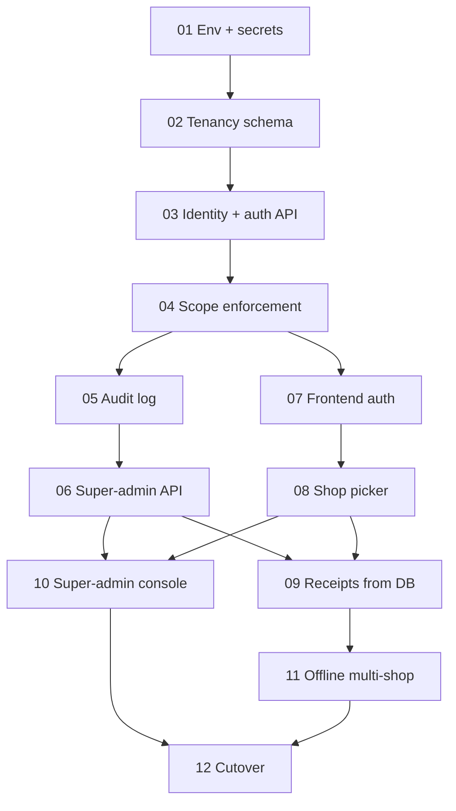

# MultiPOS Upgrade — Program Overview

Authentication, role-based access control, multi-shop tenancy, an audit trail, and
database-driven receipts for TuldokBenta.

This document is the **normative source** for the glossary, the permission matrix, the
rollout runbook and the risk register. Individual tickets reference this file rather than
restating any of it — if a rule appears in two places and they disagree, this file wins.

---

## Why

TuldokBenta today runs one laundry shop ("Spincredible") and has three structural gaps.

**There is no authentication.** `backend/middleware/index.js` installs CORS and
`express.json()` and nothing else. Every endpoint is open to the public internet: anyone
holding the backend URL can create sales, drain inventory or dump the full sales history
with `curl`. What looks like auth is a single shared password compared *in the browser*
(`ProtectedRoute.jsx` against `import.meta.env.VITE_ADMIN_PASSWORD`) guarding a boolean in
`localStorage`. The password is inlined verbatim into the production JS bundle by Vite, and
setting `localStorage.authenticated = "true"` in devtools grants full admin. Nothing records
*who* did anything, because there is no notion of a person anywhere in the system.

**Everything is hardwired to one shop.** There is no `shops` table and no `shop_id` column.
`inventory.item_name`, `services.service_name`, `payment_methods.code` and
`invoice_number` on both sale tables are all **globally** UNIQUE — so a second shop cannot
stock "Bleach", cannot offer "cash", and cannot issue `INV-0001`.

**Receipt identity is hardcoded.** Shop name, address, phone and logo URL are literals in a
template string in `webapp/tuldokbenta_web/src/utils/printInvoice.js`.

## What we are building

- Three roles — **super admin**, **manager**, **worker** — over real accounts with hashed
  passwords and JWT sessions.
- Multiple shops whose data is completely independent of one another. Existing production
  data becomes **Shop 1** and is preserved exactly.
- An append-only audit trail of every mutation and every auth event, readable by the super
  admin, designed so that reading it is never on any hot path.
- Receipt details pulled from the database and editable in the app.
- A super admin able to create shops, create and assign users, review audits, and correct
  encoded dates on sales.

## What we are explicitly not building

Password self-service reset (an admin sets passwords), MFA, per-shop reporting roll-ups
across shops, per-shop currency, and page-view analytics. Each is a defensible follow-up;
none is required by this program.

---

## Glossary

| Term | Meaning |
|---|---|
| **Shop** | A tenant. One row in `shops`. Owns its own inventory, services, payment methods, sales and receipt profile. Nothing is shared between shops. |
| **Shop 1** | The single shop that exists today. Every pre-existing row is backfilled to it. Its receipt profile is seeded from the values currently hardcoded in `printInvoice.js`. |
| **Actor** | The authenticated user performing a request. Resolved from the access token into `req.user`. |
| **Role** | One of `super_admin`, `manager`, `worker`. Stored on the user, carried in the token, and enforced by `requireRole`. |
| **Scope** | The shop a request acts on. Resolved by `resolveShop` into `req.shopId`. **Never read from the request body or query string.** |
| **Assignment** | A `user_shops` row. Determines which shops appear in a user's shop picker. Super admins are implicitly assigned to every active shop. |
| **Audit Event** | One append-only row in `audit_log` describing one mutation or auth event. |
| **Legacy Window** | The deployment period during which `LEGACY_UNAUTH=true` lets the old frontend keep working against the new backend. Ends in ticket 12. |
| **Till** | The `/open-sales` and `/open-sales-offline` pages — the counter-facing surface a worker uses. |

---

## Permission matrix

This table is normative. Tickets 04, 07 and 10 implement it; none of them redefines it.

| Capability | worker | manager | super_admin |
|---|:--:|:--:|:--:|
| Read catalog (`GET /inventory`, `GET /services`) for the till | ✓ | ✓ | ✓ |
| Read payment methods | ✓ | ✓ | ✓ |
| Open sales: create, edit, delete | ✓ | ✓ | ✓ |
| Pay a sale | ✓ | ✓ | ✓ |
| Closed sales: view, reprint, edit, revert, delete | ✓ | ✓ | ✓ |
| Write inventory (create, restock, update, delete, reorder) | — | ✓ | ✓ |
| Write services | — | ✓ | ✓ |
| Write payment methods | — | ✓ | ✓ |
| Reporting | — | ✓ | ✓ |
| Edit own shop's receipt profile | — | ✓ | ✓ |
| Create / edit / deactivate shops | — | — | ✓ |
| Create / deactivate users, assign users to shops | — | — | ✓ |
| Correct `created_at` / `paid_at` on a sale | — | — | ✓ |
| Read the audit log | — | — | ✓ |

Two notes that shape the implementation:

- **Workers keep full closed-sale access, including revert and delete.** This is a
  deliberate decision to preserve exactly what the counter can do today; the audit trail is
  the compensating control. Do not tighten it without a decision to do so.
- **`/api/inventory` is split by method.** `GET` is worker-accessible because the till
  renders its catalog from it; `POST`/`PUT`/`DELETE` are manager+. Role gating therefore
  attaches to individual routes, never to a whole router.
- **The Reporting row is a UI restriction, not an API one.** There is no reporting endpoint —
  the page derives every figure in the browser from `GET /api/closed-sales` and
  `GET /api/open-sales`. Because workers keep full closed-sales access, a worker with a valid
  token can fetch the same rows and compute the same totals. Hiding the nav link is a
  convenience; do not describe it as a control anywhere. See ticket 04's design for why
  closing it properly is out of scope.

---

## Ticket map

Each ticket is sized to one working session. Tickets 01–06 are backend-only and each is
independently deployable — the live app keeps working untouched through all of them,
because `LEGACY_UNAUTH=true` is in force.

| # | Ticket | Depends on |
|---|---|---|
| 01 | [Environment & secrets groundwork](01-env-and-secrets/requirements.md) | — |
| 02 | [Tenancy schema & backfill](02-tenancy-schema/requirements.md) | 01 |
| 03 | [Identity schema & auth API](03-identity-and-auth/requirements.md) | 02 |
| 04 | [Enforce scope across the existing API](04-scope-enforcement/requirements.md) | 03 |
| 05 | [Audit log](05-audit-log/requirements.md) | 04 |
| 06 | [Super-admin API](06-superadmin-api/requirements.md) | 05 |
| 07 | [Frontend auth](07-frontend-auth/requirements.md) | 03, 04 |
| 08 | [Shop picker & shop-scoped cache](08-shop-picker/requirements.md) | 07 |
| 09 | [DB-driven receipts](09-receipts-from-db/requirements.md) | 06, 08 |
| 10 | [Super-admin console](10-superadmin-console/requirements.md) | 06, 08 |
| 11 | [Offline page under auth & multi-shop](11-offline-multi-shop/requirements.md) | 08, 09 |
| 12 | [Cutover & hardening](12-cutover-and-hardening/requirements.md) | all |

---

## Rollout runbook

Run in this order. Steps 2–6 are invisible to the shop.

1. **Provision the new secrets** (ticket 01). Generate `JWT_ACCESS_SECRET` and
   `JWT_REFRESH_SECRET` and set them on the backend host. Everything after this assumes they
   exist — ticket 03 refuses to boot without them.
2. **Set `LEGACY_UNAUTH=true`** in the backend host's environment *before* deploying ticket
   03. With the flag on, a request with no token is treated as a manager on Shop 1, exactly
   as today.
3. **Deploy tickets 02 → 06**, one at a time. After each, confirm the till still works and
   row counts are unchanged. `initDB()` runs at every boot and is idempotent.
4. **Seed the first super admin** (ticket 03) via the one-time env-driven seed, then log in
   and change the password immediately.
5. **Deploy tickets 07 → 11** to Vercel. The new frontend now sends tokens; the backend
   accepts both authenticated and legacy requests, so a rollback to the old bundle is still
   safe at this point.
6. **Verify** as each of the three roles against a real shop. Create a second shop and
   confirm its data is fully independent.
7. **Flip `LEGACY_UNAUTH=false`** (ticket 12) and confirm an unauthenticated `curl` gets a
   401. This is the point of no return for the old frontend.
8. **Delete the bypass code** and redeploy.

**Rollback posture.** Through step 5, rolling back is redeploying the previous frontend
bundle — the backend still serves it. After step 7, rollback means setting the flag back to
`true`. The schema changes in ticket 02 are additive and never dropped, so no deploy in this
program requires a schema rollback.

---

## Risk register

| # | Risk | Why it bites | Mitigation |
|---|---|---|---|
| R1 | **Composite UNIQUE swap on a populated table** | Dropping `inventory_item_name_key` and adding `UNIQUE (shop_id, item_name)` runs against live data. If the backfill has not completed, the add fails and `initDB()` calls `process.exit(1)` — the backend will not boot. | Ticket 02 orders backfill strictly before every constraint change, in the same boot. Rehearse the whole boot against a copy of production first. |
| R2 | **Sale stock updates match inventory by name string with no FK** | `applyStockAndSale` (`openSalesController.js:31-40`) runs `UPDATE inventory … WHERE item_name = ${name}`. Miss the shop predicate and Shop B's sale silently decrements Shop A's stock. | Ticket 04 treats every `WHERE item_name` / `WHERE service_name` / `WHERE code` as a scoping site, and its checklist counts statements rather than files. |
| R3 | **Offline queue stranded by the key rename** | A real device may right now hold an unsynced sale in `localStorage["offline_sales"]`. Namespacing the key to `offline_sales:1` without migrating loses that sale — and its money. | Ticket 11 performs a one-time read-old → write-new → delete-old migration on first boot, and the migration is the first task in the ticket. |
| R4 | **Date corrections silently rewrite history** | Reports bucket on `created_at` and `paid_at`. Moving a sale's date changes past reports with no visible trace on the report itself. | Ticket 06 audits every correction with full before/after, transactionally. Ticket 10's UI states the consequence in the confirm dialog. |
| R5 | **Deactivation lag** | `requireAuth` does not hit the database, so a deactivated user's access token stays valid until it expires — up to 60 minutes. | Documented and accepted. `token_version` gives an immediate "sign out everywhere" for the urgent case; refresh is refused instantly. |
| R6 | **Invoice numbering resets if a prefix is edited** | Numbering is derived by parsing `^INV-([0-9]+)$`. Change the prefix and the parse stops matching, `MAX` returns 0, and the shop restarts at 1 — colliding with its own history. | Ticket 02 adds an `invoice_seq` integer column as the real sequence, leaving `invoice_number` as display only. |
| R7 | **Cross-shop cache bleed** | `queryKeys` have no shop dimension and the cache is persisted to `localStorage` for 24h. Switching shops would serve the previous shop's rows, including from disk after a reload. | Ticket 08 adds a shop dimension to every key *and* clears the persisted cache on switch. |
| R8 | **`useOfflineCatalog` bypasses `apiRequest`** | It is the only place in the app calling raw `fetch`, so it will not pick up the auth or shop headers and will fail quietly with a stale catalog. | Called out explicitly as a task in ticket 07. |
| R10 | **The current shared admin password is burned** | `VITE_ADMIN_PASSWORD` is a `VITE_`-prefixed build-time variable, so Vite inlines it verbatim into the production bundle. Every person who has ever loaded the app has been served it in plain text. (It is *not* in git — no `.env` has ever been committed, and `dist/` is untracked — but the bundle exposure alone is total.) | Ticket 01 records it as compromised; it must never become any account's password. Ticket 07 deletes the variable and the gate together. |
| R9 | **Ticket 04 is large** | ~46 SQL statements across six files in one session. A partial application leaves some queries unscoped — the worst failure mode, because it is silent. | If it overruns, split by controller (not by layer) so each split is independently verifiable. The task list is ordered to make that clean. |

---

## Conventions for these specs

- `requirements.md` uses EARS phrasing — `THE <component> SHALL …`,
  `WHEN <trigger>, THE <component> SHALL …`, `IF <condition>, THEN THE <component> SHALL …`
  — with a User Story per requirement, matching `.kiro/specs/backend-code-cleanup/`.
- `tasks.md` uses checkboxes and closes each task with a `_Requirements: N.N_` back-reference
  into its sibling `requirements.md`. Every ticket ends with a verification checkpoint task.
- All backend files are ES Modules (`"type": "module"`). All frontend files are plain JSX;
  there is no TypeScript and no path aliases — every import is a hand-written relative path.
- The schema has no migration tool. `backend/config/initDB.js` is the sole source of truth
  and runs on every boot, so every statement added to it must be idempotent.
