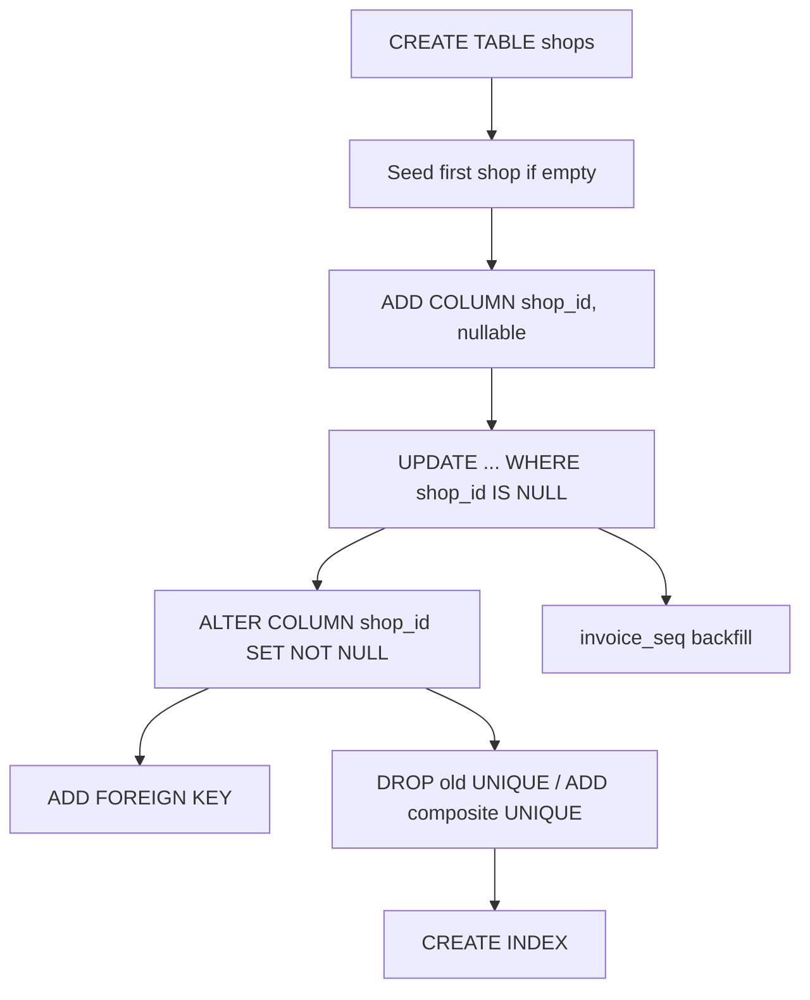

# Design: Tenancy Schema & Backfill

## Overview

One file changes: `backend/config/initDB.js`. Everything else in the backend is untouched,
and the frontend is untouched.

The whole design rests on one constraint: **there is no migration tool.** `initDB()` runs on
every boot, before `app.listen`, and on failure calls `process.exit(1)`. So every statement
must be idempotent, and a statement that fails takes the server down. That makes ordering
load-bearing in a way it would not be under a versioned migration runner — a constraint added
before its backfill completes does not just fail, it prevents the backend from starting.

The file already establishes the three idioms this ticket needs, and the design follows them
rather than inventing new ones:

| Idiom | Existing example |
|---|---|
| Add column, backfill only NULLs, so re-runs are no-ops | `sort_order` on `inventory`, `initDB.js:65-76` |
| Add a constraint under a duplicate-tolerant guard | `inventory_stock_non_negative`, `initDB.js:54-59` |
| Seed a table only when it is empty, not `ON CONFLICT` | `payment_methods`, `initDB.js:136-159` |

---

## Architecture

```
backend/config/initDB.js
  ├── [existing] CREATE TABLE open_sales / closed_sales / inventory / services
  ├── [existing] stock CHECK constraint, sort_order columns + backfills
  ├── [existing] customer_name columns
  ├── [existing] CREATE TABLE payment_methods, idx_closed_sales_paid_using, seed
  │
  └── [NEW] ─── Tenancy block, appended after all existing statements ───
        1. CREATE TABLE shops
        2. Seed the first shop (guarded on empty)
        3. For each of 5 tables: ADD COLUMN shop_id → backfill → SET NOT NULL → ADD FK
        4. For each of 5 tables: DROP old UNIQUE → ADD composite UNIQUE
        5. invoice_seq columns + parse backfill
        6. Indexes
```

**Appending rather than interleaving is deliberate.** The tenancy block runs after every
existing statement, so the tables and columns it depends on are guaranteed to exist on a
fresh database as well as on a populated one. The block is internally ordered, and that
internal order is what Requirements 3.7 and 4.7 pin down.

### Migration order, and why it cannot be rearranged



- **B before C** — the backfill in D needs a shop to point at. On an empty database the seed
  still runs, so a fresh install and an upgrade take the same path.
- **D before E** — `SET NOT NULL` scans the table and fails on any remaining NULL. That
  failure exits the process, so the backend would not boot.
- **E before G** — the composite UNIQUE includes `shop_id`. Adding it while NULLs remain
  produces a constraint that does not mean what it says (NULLs do not conflict in a UNIQUE
  index, so every un-backfilled row would be permitted).

---

## Data Models

### New table: `shops`

| Column | Type | Notes |
|---|---|---|
| `id` | SERIAL PRIMARY KEY | |
| `name` | VARCHAR(255) NOT NULL | Receipt header and picker label. Freely editable |
| `slug` | VARCHAR(50) UNIQUE NOT NULL | Stable key. Never changes once set |
| `address_line` | VARCHAR(255) | Receipt line 2 |
| `contact_number` | VARCHAR(50) | Receipt line 3 |
| `logo_url` | TEXT | Receipt logo. A URL today; ticket 09 may allow a data URI |
| `receipt_footer` | VARCHAR(255) DEFAULT `'Thank you for your purchase!'` | |
| `receipt_paper_width_mm` | INT NOT NULL DEFAULT 58 | Matches the current hardcoded width |
| `invoice_prefix` | VARCHAR(10) NOT NULL DEFAULT `'INV-'` | Display prefix only |
| `is_active` | BOOLEAN NOT NULL DEFAULT TRUE | Inactive shops disappear from pickers |
| `created_at` | TIMESTAMP DEFAULT CURRENT_TIMESTAMP | |

`slug` exists for the same reason `payment_methods` separates `code` from `label`, and the
comment at `initDB.js:106-109` already explains that reasoning: a display name that doubles
as a key splits your data the moment someone renames it.

### Changed tables

Every Scoped Table gains:

| Column | Type | Notes |
|---|---|---|
| `shop_id` | INT NOT NULL REFERENCES `shops(id)` | Added nullable, backfilled, then constrained |

`open_sales` and `closed_sales` additionally gain:

| Column | Type | Notes |
|---|---|---|
| `invoice_seq` | INT NULL | Parsed from `invoice_number`; NULL when unparseable |

### Constraint changes

| Table | Dropped | Added |
|---|---|---|
| `inventory` | `inventory_item_name_key` | `inventory_shop_item_unique (shop_id, item_name)` |
| `services` | `services_service_name_key` | `services_shop_name_unique (shop_id, service_name)` |
| `payment_methods` | `payment_methods_code_key` | `payment_methods_shop_code_unique (shop_id, code)` |
| `open_sales` | `open_sales_invoice_number_key` | `open_sales_shop_invoice_unique (shop_id, invoice_number)` |
| `closed_sales` | `closed_sales_invoice_number_key` | `closed_sales_shop_invoice_unique (shop_id, invoice_number)` |

The dropped names are Postgres's automatic names for a column-level `UNIQUE`
(`<table>_<column>_key`). The new ones are given explicitly so they can be dropped by name
later without guessing.

---

## Migration Approach

The exact statements, in order. All appended to `initDB()` inside the existing `try` block.

### Step 1 — `shops`

```sql
CREATE TABLE IF NOT EXISTS shops (
  id SERIAL PRIMARY KEY,
  name VARCHAR(255) NOT NULL,
  slug VARCHAR(50) UNIQUE NOT NULL,
  address_line VARCHAR(255),
  contact_number VARCHAR(50),
  logo_url TEXT,
  receipt_footer VARCHAR(255) DEFAULT 'Thank you for your purchase!',
  receipt_paper_width_mm INT NOT NULL DEFAULT 58,
  invoice_prefix VARCHAR(10) NOT NULL DEFAULT 'INV-',
  is_active BOOLEAN NOT NULL DEFAULT TRUE,
  created_at TIMESTAMP DEFAULT CURRENT_TIMESTAMP
)
```

### Step 2 — Seed the first shop

```sql
INSERT INTO shops (name, slug, address_line, contact_number, logo_url, receipt_footer)
SELECT 'SPINCREDIBLE', 'spincredible', 'Rizal Street Ext', 'Mo: 0962-683-7430',
       'https://i.ibb.co/NFtDrgj/SPINCREDIBLE.png', 'Thank you for your purchase!'
WHERE NOT EXISTS (SELECT 1 FROM shops)
```

Values lifted verbatim from `printInvoice.js:120-132`. Guarded on empty, not
`ON CONFLICT DO NOTHING`, for the same reason the `payment_methods` seed is
(`initDB.js:133-135`): a row an admin deliberately deleted must stay deleted.

### Step 3 — `shop_id`, per table

Repeated for `inventory`, `services`, `payment_methods`, `open_sales`, `closed_sales`:

```sql
ALTER TABLE inventory ADD COLUMN IF NOT EXISTS shop_id INT;

UPDATE inventory
   SET shop_id = (SELECT id FROM shops ORDER BY id LIMIT 1)
 WHERE shop_id IS NULL;

ALTER TABLE inventory ALTER COLUMN shop_id SET NOT NULL;

DO $$ BEGIN
  ALTER TABLE inventory
    ADD CONSTRAINT inventory_shop_fk FOREIGN KEY (shop_id) REFERENCES shops(id);
EXCEPTION WHEN duplicate_object THEN NULL; END $$;
```

`SET NOT NULL` on a column that is already NOT NULL is a no-op, so the sequence is safe to
re-run. `WHERE shop_id IS NULL` means the second boot updates zero rows — the same guard the
`sort_order` backfill uses at `initDB.js:75`.

> **Do not collapse this into `ADD COLUMN … NOT NULL DEFAULT 1`.** It would hardcode the id,
> and it would attach a permanent column default that silently absorbs a future insert that
> forgot its `shop_id` — exactly the bug ticket 04's whole review pass is meant to catch.

### Step 4 — Constraint swap, per table

```sql
ALTER TABLE inventory DROP CONSTRAINT IF EXISTS inventory_item_name_key;

DO $$ BEGIN
  ALTER TABLE inventory
    ADD CONSTRAINT inventory_shop_item_unique UNIQUE (shop_id, item_name);
EXCEPTION WHEN duplicate_object THEN NULL; END $$;
```

Dropping the old UNIQUE also drops its backing index. That is fine: the new composite index
on `(shop_id, item_name)` serves the lookups ticket 04 will write
(`WHERE shop_id = $1 AND item_name = $2`), because `shop_id` is the leading column.

### Step 5 — `invoice_seq`

```sql
ALTER TABLE open_sales   ADD COLUMN IF NOT EXISTS invoice_seq INT;
ALTER TABLE closed_sales ADD COLUMN IF NOT EXISTS invoice_seq INT;

UPDATE open_sales
   SET invoice_seq = (substring(invoice_number from '^INV-([0-9]+)$'))::int
 WHERE invoice_seq IS NULL;

UPDATE closed_sales
   SET invoice_seq = (substring(invoice_number from '^INV-([0-9]+)$'))::int
 WHERE invoice_seq IS NULL;
```

`substring(... from <regex>)` yields NULL when the value does not match, and the cast of NULL
is NULL — so a hand-edited `INV-abc` stores NULL instead of failing the migration. This is
the same tolerance the existing `highestInvoiceSeq` query relies on
(`backend/utils/invoiceNumber.js:39-41` documents it).

Note the backfill leaves those rows permanently NULL on every subsequent boot, since the
guard is `WHERE invoice_seq IS NULL`. That is intended: there is no correct integer to invent
for a number that was never in the series, and `MAX()` ignoring it reproduces exactly what
happens today.

### Step 6 — Indexes

```sql
CREATE INDEX IF NOT EXISTS idx_open_sales_shop_created   ON open_sales   (shop_id, created_at);
CREATE INDEX IF NOT EXISTS idx_closed_sales_shop_paid    ON closed_sales (shop_id, paid_at);
CREATE INDEX IF NOT EXISTS idx_closed_sales_shop_created ON closed_sales (shop_id, created_at);
CREATE INDEX IF NOT EXISTS idx_closed_sales_shop_method  ON closed_sales (shop_id, paid_using);
DROP INDEX IF EXISTS idx_closed_sales_paid_using;
```

The old single-column `paid_using` index is dropped last, after its replacement exists, so
there is no window without one.

### Rollback

There is none, by design, and none is needed. Every change is additive: no column is dropped,
no type changes, no data is rewritten except NULL backfills. The pre-upgrade backend runs
unmodified against the post-upgrade schema, because it never mentions `shop_id` and the
composite UNIQUE is strictly weaker than the global one it replaced — every insert the old
code makes still satisfies it.

The one asymmetry: reverting *the schema* would require re-adding the global UNIQUE
constraints, which would fail if a second shop had been created. Since no second shop can
exist until ticket 06 ships, there is a wide safe window.

---

## Error Handling

| Condition | Detection | Handling |
|---|---|---|
| `SET NOT NULL` finds a NULL `shop_id` | `initDB` throws, `process.exit(1)`, server will not boot | Means the backfill did not run or matched nothing. Check that `shops` has a row — the seed guard is the usual culprit |
| Composite UNIQUE add finds duplicates | Throws `unique_violation` (not `duplicate_object`, so the guard does not swallow it) | Genuine duplicate data. Must be resolved by hand before the migration can complete |
| Old constraint name does not match | `DROP CONSTRAINT IF EXISTS` silently does nothing, then the composite add succeeds | Both constraints then coexist and the old global one still blocks a second shop. **Verify by querying `pg_constraint` after the migration**, not by trusting the drop |
| `shops` seeded twice | Impossible — guarded on `NOT EXISTS` | |
| Fresh database | Seed runs, backfills match zero rows, constraints apply to empty tables | Identical end state to an upgraded database |
| `invoice_number` does not match the pattern | `substring` returns NULL | Row keeps `invoice_seq = NULL`; documented and intended |

The third row is the one to watch. `DROP CONSTRAINT IF EXISTS` failing to match is silent,
and the symptom appears much later — the second shop cannot be created. The verification task
queries `pg_constraint` directly rather than assuming.

---

## Correctness Properties

Property-based testing does not apply to this ticket: it is DDL against an external database,
with no pure function and no input space to quantify over. What matters here are **structural
invariants**, checked by SQL after the migration runs.

### SP1 — Every row belongs to a shop

`SELECT COUNT(*) FROM <table> WHERE shop_id IS NULL` returns 0 for all five Scoped Tables.

*Validates: 3.2, 3.4*

### SP2 — Row counts are unchanged

The count of each Scoped Table matches the count taken immediately before the migration.

*Validates: 7.4*

### SP3 — The old global constraints are gone

```sql
SELECT conname FROM pg_constraint
WHERE conname IN ('inventory_item_name_key','services_service_name_key',
                  'payment_methods_code_key','open_sales_invoice_number_key',
                  'closed_sales_invoice_number_key');
```
returns zero rows.

*Validates: 4.1–4.5*

### SP4 — The composite constraints exist

The same query against the five new constraint names returns exactly five rows.

*Validates: 4.1–4.5*

### SP5 — Idempotence

Running `initDB()` a second time completes without error, and SP1–SP4 still hold with
identical row counts.

*Validates: 3.6*

### SP6 — Invoice sequences parsed

`SELECT COUNT(*) FROM closed_sales WHERE invoice_seq IS NULL AND invoice_number ~ '^INV-[0-9]+$'`
returns 0 — every well-formed number got a sequence.

*Validates: 5.2, 5.3*

---

## Testing Strategy

This ticket is DDL, so the test is a rehearsal against real data, not a unit test.

### Rehearsal against a production copy — mandatory before deploying

1. Take a Neon branch or dump/restore of the production database into a scratch database.
2. Record `SELECT COUNT(*)` for all five Scoped Tables.
3. Point `DATABASE_URL` at the scratch copy and run `npm run dev` in `backend/`.
4. Confirm `✅ Database initialized successfully` and that the server reaches `app.listen`.
5. Run SP1 through SP6.
6. Stop and restart the server; run SP5 again.

### Regression check — the API must not have moved

Against the same scratch database, with the **unmodified** frontend pointed at it:

| Check | Expected |
|---|---|
| `GET /api/health` | `{ status: "ok" }` |
| `GET /api/inventory` | Same rows as before, now each carrying `shop_id` |
| `GET /api/closed-sales?...` | Same rows and same ordering as before |
| Create a sale through the UI | Succeeds; stock decrements; invoice number continues the existing series |
| Pay that sale | Moves to closed sales as before |
| Revert it | Moves back as before |

The extra `shop_id` and `invoice_seq` fields appearing in JSON responses are harmless — the
frontend reads named fields and ignores unknown ones.

### Automated tests

None are added. There is no new pure function to test; `backend/utils/*.test.js` stays as it
is. The invoice-numbering logic changes in ticket 04, and its tests belong there.
