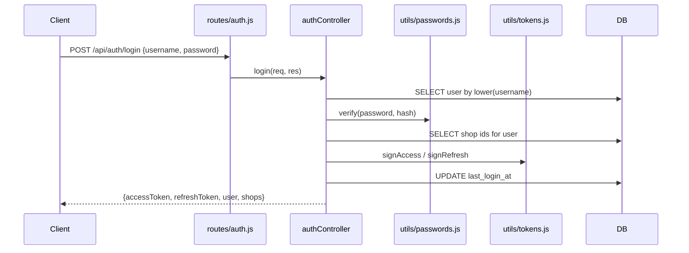

# Design: Identity Schema & Auth API

## Overview

Adds identity to a backend that has none. Two new tables, one new router with its controller,
two new middleware modules, one new pure token utility, and a seed step in `initDB()`.

The organising decision: **auth becomes available here, and mandatory in ticket 04.** The new
middlewares are written and tested but mounted on nothing except the new `/api/auth` routes.
Existing endpoints stay open. That makes this ticket independently deployable to production
against the live frontend.

---

## Architecture

```
backend/
├── config/
│   ├── env.js              ← from ticket 01; provides secrets + TTLs + legacy flag
│   └── initDB.js           ← + users, user_shops, super-admin seed
├── utils/
│   ├── tokens.js           ← NEW: pure sign/verify. No DB, no Express
│   ├── tokens.test.js      ← NEW
│   ├── passwords.js        ← NEW: bcrypt hash/compare + policy
│   └── passwords.test.js   ← NEW
├── middleware/
│   ├── index.js            ← unchanged; the limiter lives in routes/auth.js
│   ├── auth.js             ← NEW: requireRealAuth, requireAuth, requireRole
│   ├── auth.test.js        ← NEW (flag off)
│   ├── auth.legacy.test.js ← NEW (flag on — P6)
│   ├── shopScope.js        ← NEW: resolveShop
│   ├── shopScope.test.js   ← NEW (flag off)
│   ├── shopScope.legacy.test.js ← NEW (flag on)
│   └── httpDoubles.js      ← NEW: test-only req/res stand-ins
├── controllers/
│   └── authController.js   ← NEW
├── routes/
│   └── auth.js             ← NEW
└── server.js               ← mounts /api/auth only
```

`utils/tokens.js` and `utils/passwords.js` are pure — no `sql` import, no `req`/`res`. This
matches the existing discipline in `utils/saleItems.js` and `utils/paymentMethods.js`, which
take rows as parameters and are unit-testable without a database. It is also what makes the
token rules testable at all.

### Request flow



---

## Data Models

### `users`

| Column | Type | Notes |
|---|---|---|
| `id` | SERIAL PRIMARY KEY | |
| `username` | VARCHAR(50) UNIQUE NOT NULL | Stored lowercased; lookups lowercase the input |
| `password_hash` | TEXT NOT NULL | bcrypt, cost 10 |
| `full_name` | VARCHAR(255) NOT NULL | Shown in the audit log and the nav bar |
| `role` | VARCHAR(20) NOT NULL | CHECK in (`super_admin`,`manager`,`worker`) |
| `is_active` | BOOLEAN NOT NULL DEFAULT TRUE | Deactivation is the delete path |
| `must_change_password` | BOOLEAN NOT NULL DEFAULT FALSE | Set on seed and on admin reset |
| `token_version` | INT NOT NULL DEFAULT 0 | Bump to invalidate all refresh tokens |
| `last_login_at` | TIMESTAMP NULL | |
| `created_at` | TIMESTAMP DEFAULT CURRENT_TIMESTAMP | |
| `created_by` | INT REFERENCES users(id) | NULL for the seeded account |

Username is stored lowercased so that `Maria` and `maria` cannot become two accounts. The
UNIQUE constraint enforces it only if the write path is disciplined, so normalisation belongs
in one helper used by both the login lookup and the create path.

### `user_shops`

| Column | Type | Notes |
|---|---|---|
| `user_id` | INT NOT NULL REFERENCES users(id) ON DELETE CASCADE | |
| `shop_id` | INT NOT NULL REFERENCES shops(id) ON DELETE CASCADE | |
| | PRIMARY KEY (`user_id`, `shop_id`) | |

The composite primary key is the whole table — there is no surrogate id, because there is
nothing to reference an assignment by.

### The public user shape

The one shape returned by `/login`, `/refresh`, `/me` and every super-admin endpoint. It
never contains `password_hash` or `token_version`.

```js
{ id, username, full_name, role, is_active, must_change_password, last_login_at }
```

A single `toPublicUser(row)` helper produces it, so a new column added to `users` cannot leak
by being picked up by a `SELECT *` that someone forgot to narrow.

---

## Components and Interfaces

### `utils/tokens.js`

```js
export const signAccessToken  = (user, shopIds) => /* jwt.sign, env.accessSecret  */;
export const signRefreshToken = (user)          => /* jwt.sign, env.refreshSecret */;
export const verifyAccessToken  = (token) => /* payload | null */;
export const verifyRefreshToken = (token) => /* payload | null */;
```

Payloads:

```js
// access  — everything a request needs, so requireAuth never reads the database
{ sub: 12, username: "maria", role: "manager", shops: [1, 3] }

// refresh — deliberately minimal
{ sub: 12, tv: 0 }
```

Two decisions worth stating:

- **The access token carries the shop list.** That is what lets `requireAuth` and
  `resolveShop` run with zero database round trips, keeping the hot path — every till
  request — at one query. The cost is staleness: a shop assignment changed by a super admin
  does not reach the user until their next refresh, up to 60 minutes. Accepted, and noted in
  the overview's risk register.
- **The refresh token carries only `sub` and `tv`.** It is the long-lived half; putting a
  role in it would mean a demoted user could keep minting manager access tokens for 30 days.
  The refresh endpoint re-reads role and shops from the database every time.

Verification returns `null` rather than throwing, so callers branch instead of wrapping every
call in `try`.

### `utils/passwords.js`

`bcryptjs`, not the native `bcrypt` — the fallback the tasks already anticipate. Pure
JavaScript, so there is no node-gyp step to fail on the deploy host or on a Windows dev
machine; the API and the cost-factor argument are identical, so nothing else changes. It is
slower per hash (~100ms at cost 10 rather than ~60ms), which is irrelevant at a shop's login
volume and is arguably a feature on a login endpoint.

```js
export const hashPassword   = (plain) => bcrypt.hash(plain, 10);
export const verifyPassword = (plain, hash) => bcrypt.compare(plain, hash);
export const assertPasswordPolicy = (plain) => { /* throws badRequest under 8 chars */ };
export const normalizeUsername = (raw) => String(raw ?? "").trim().toLowerCase();

// A real bcrypt hash of a fixed throwaway string, compared against when the username
// is unknown so that a missing account and a wrong password take the same time.
export const DUMMY_HASH = "$2b$10$...";
```

`assertPasswordPolicy` throws using the existing `badRequest` helper from
`utils/saleItems.js`, so auth errors flow through the same `toErrorResponse` translation the
rest of the backend already uses. No second error convention is introduced.

### `middleware/auth.js`

```js
export const requireAuth = (req, res, next) => {
  const header = req.header("authorization");

  // Legacy window (ticket 12 deletes this block).
  // Guarded on the header being ABSENT, not on verification failing: a present-but-invalid
  // token must 401. Falling back here would let anyone escalate to manager by sending
  // a deliberately broken token.
  if (!header && env.legacyUnauth) {
    req.user = { id: null, username: "legacy", role: "manager", shops: [env.legacyShopId], legacy: true };
    return next();
  }

  const token = header?.startsWith("Bearer ") ? header.slice(7) : null;
  const payload = token && verifyAccessToken(token);
  if (!payload) return res.status(401).json({ message: "Sign in to continue" });

  req.user = { id: payload.sub, username: payload.username, role: payload.role, shops: payload.shops ?? [] };
  next();
};

export const requireRole = (...roles) => (req, res, next) =>
  roles.includes(req.user?.role)
    ? next()
    : res.status(403).json({ message: "You do not have access to this action" });
```

The `!header && env.legacyUnauth` condition is the single most security-sensitive line in
this ticket. Written as `if (env.legacyUnauth && !payload)` it would turn every invalid token
into a manager session.

#### `requireAuth` vs `requireRealAuth`

The module exports **two** guards, and the distinction matters:

| Guard | Legacy fallback | Used by |
|---|---|---|
| `requireAuth` | Yes, while the flag is on | The existing till/admin routes, mounted in ticket 04 |
| `requireRealAuth` | **Never** | Every route under `/api/auth`, and every super-admin route in ticket 06 |

`requireRealAuth` is `requireAuth` without the bypass block. The auth routes need it because
the synthetic legacy actor has `id: null` — `GET /api/auth/me` would have no row to return
and `POST /api/auth/change-password` would have no row to update. A synthetic actor is a
stand-in for "the old frontend is calling the old endpoints", and the auth endpoints are by
definition not that.

Ticket 06 uses it for a second reason: a super-admin route must never be reachable through a
bypass that grants the *manager* role anyway, but pinning it to the strict guard removes the
question entirely.

Implement `requireAuth` as the bypass check followed by a delegation to `requireRealAuth`, so
the token-verification logic exists once.

### `middleware/shopScope.js`

Exported through a factory rather than as a bare middleware:

```js
export const makeResolveShop = (sql) => async (req, res, next) => { /* … */ };
export const resolveShop = makeResolveShop(sql);   // what ticket 04 imports
```

The super-admin branch below is the one branch in either middleware that touches the
database, and the Testing Strategy asks for it to be covered. ESM has no clean way to
substitute a module-level import, so `sql` comes in as a parameter — the same shape
`utils/invoiceNumber.js` already uses, and for the same reason. Ticket 04's
`import { resolveShop }` is unaffected.

```js
export const resolveShop = async (req, res, next) => {
  const raw = req.header("x-shop-id");

  if (!raw && env.legacyUnauth && req.user?.legacy) {
    req.shopId = env.legacyShopId;          // ticket 12 deletes this
    return next();
  }

  const shopId = Number(raw);
  if (!Number.isInteger(shopId) || shopId <= 0) {
    return res.status(400).json({ message: "No shop selected" });
  }

  if (req.user.role === "super_admin") {
    const rows = await sql`SELECT 1 FROM shops WHERE id = ${shopId} AND is_active = TRUE`;
    if (rows.length === 0) return res.status(403).json({ message: "Shop not found" });
  } else if (!req.user.shops.includes(shopId)) {
    return res.status(403).json({ message: "You are not assigned to that shop" });
  }

  req.shopId = shopId;                       // the ONLY value controllers may scope by
  next();
};
```

Super admins are checked against the database rather than against the token, because their
access is "every active shop" — a set that changes when a shop is created, and one that would
otherwise be stale in their token for up to an hour. That is one extra query, but only for
super admins, who are not the ones running the till.

### `controllers/authController.js`

| Handler | Route | Notes |
|---|---|---|
| `login` | `POST /api/auth/login` | Normalises username; compares against `DUMMY_HASH` when the account is missing; 401 with one generic message for wrong password, unknown user and inactive account alike |
| `refresh` | `POST /api/auth/refresh` | Re-reads the user; rejects on inactive or `tv` mismatch; returns a fresh access token with freshly-read role and shops |
| `me` | `GET /api/auth/me` | `requireRealAuth`; re-reads the user and returns public user + shops. Deliberately not answered from the token: this is what the frontend calls on boot to decide whether a stored session is still good, and the token would happily confirm a session for an account deactivated an hour ago |
| `logout` | `POST /api/auth/logout` | `requireRealAuth`; server-side it is a no-op that exists so ticket 05 has somewhere to record the event |
| `changePassword` | `POST /api/auth/change-password` | `requireRealAuth`; verifies the current password, applies the policy, hashes, clears `must_change_password`, bumps `token_version` |

`changePassword` bumping `token_version` means every other device holding a refresh token for
that account is signed out on its next refresh. That is the desired behaviour when the reason
for the change is a suspected leak.

`logout` is intentionally a no-op rather than a token blacklist. Blacklisting a stateless JWT
requires a store and a lookup on every request, which reintroduces the per-request database
read the token payload exists to avoid. The client discards its tokens; the access token dies
within an hour; `token_version` is the lever for the case that cannot wait.

### `routes/auth.js` and mounting

```js
// server.js — the only mount added in this ticket
app.use("/api/auth", authRouter);
```

Every existing `app.use` line is untouched. Nothing else in `server.js` changes except the
legacy-mode startup warning and one `app.set("trust proxy", 1)`.

**`trust proxy` is required for the rate limiter to mean anything.** `express-rate-limit`
buckets by `req.ip`, and a hosted deploy sits behind a load balancer — without this, every
request arrives wearing the balancer's address and the entire internet shares one attempt
budget. It is `1` rather than `true` on purpose: trusting the whole forwarded chain lets a
client set its own `X-Forwarded-For` and hop to a fresh bucket per guess, which is worse than
not rate limiting at all.

### Rate limiting

`express-rate-limit` applied inside `routes/auth.js` to the login and refresh routes only —
not in `applyMiddleware`, which must keep serving the till at full speed.

A window of 15 minutes and a cap of 20 attempts per IP is far above a shop's real usage (a
shift change is a handful of logins) and far below a useful brute-force rate. Successful
logins are not counted against the limit, so a busy legitimate terminal never trips it.

**One limiter instance each, not one shared between the two routes.** A whole shop sits
behind a single public IP, so a shared bucket would let one tab looping on an invalidated
refresh token — which answers 401 every time, and which a client retries with nobody
watching — spend the budget that signing in needs and lock the counter out for fifteen
minutes. Two buckets keep a broken session from becoming a shop-wide outage. Verified: each
route allows exactly 20 failures independently of the other.

---

## Error Handling

| Condition | Status | Body |
|---|---|---|
| Login with unknown username, wrong password, or inactive account | 401 | `{ message: "Incorrect username or password" }` — one message for all three |
| Login with missing username or password | 400 | `{ message: "Username and password are required" }` |
| Login rate limit exceeded | 429 | `{ message: "Too many attempts. Try again shortly." }` |
| Refresh with an expired, malformed or wrongly-signed token | 401 | `{ message: "Session expired. Sign in again." }` |
| Refresh where `tv` does not match, or account inactive | 401 | Same message as above |
| `requireAuth` with no or invalid access token | 401 | `{ message: "Sign in to continue" }` |
| `requireRole` mismatch | 403 | `{ message: "You do not have access to this action" }` |
| `resolveShop` with missing or non-numeric `X-Shop-Id` | 400 | `{ message: "No shop selected" }` |
| `resolveShop` with an unassigned shop | 403 | `{ message: "You are not assigned to that shop" }` |
| Change password with a wrong current password | 401 | `{ message: "Current password is incorrect" }` |
| New password under 8 characters | 400 | `{ message: "Password must be at least 8 characters" }` |
| New password equal to the current one | 400 | `{ message: "New password must be different" }` — otherwise `must_change_password` clears while the burned password stays in force, which is the one thing the flag exists to prevent |
| Seed credentials missing and `users` empty | — | Warning logged, boot continues |

The single 401 message across unknown-user, wrong-password and inactive-account is
deliberate: distinguishing them turns the login form into an account enumerator. The dummy
bcrypt comparison closes the same hole on the timing side.

---

## Correctness Properties

The frontend suite already uses `fast-check`, and the backend has genuinely pure functions
here, so property tests earn their place for the first time in this program.

### P1 — Round-trip integrity

For any user record and shop list, `verifyAccessToken(signAccessToken(user, shops))` yields a
payload whose `sub`, `role` and `shops` equal the inputs.

*Validates: 4.1, 4.2*

### P2 — Keys are not interchangeable

For any user, `verifyRefreshToken(signAccessToken(...))` returns `null`, and
`verifyAccessToken(signRefreshToken(...))` returns `null`.

*Validates: 4.4*

### P3 — Tampering is always detected

For any signed token and any single-character mutation of it, verification returns `null`.

*Validates: 4.6*

### P4 — Password round-trip

For any string of 8 or more characters, `verifyPassword(p, await hashPassword(p))` is true,
and for any two distinct strings the cross-comparison is false.

*Validates: 3.1, 3.2*

### P5 — Username normalisation is idempotent and case-folding

For any string, `normalizeUsername(normalizeUsername(s)) === normalizeUsername(s)`, and for
any string, `normalizeUsername(s) === normalizeUsername(s.toUpperCase())`.

*Validates: 1.2*

### P6 — The legacy bypass never fires on a present header

For any non-empty `Authorization` header value and with `legacyUnauth` enabled, `requireAuth`
either sets a `req.user` derived from a genuinely valid token or responds 401 — it never
produces the synthetic legacy actor.

*Validates: 7.3*

P6 is the one that matters most. It is the difference between a compatibility window and an
authentication bypass, and it is cheap to assert exhaustively.

---

## Testing Strategy

Backend tests use Node's built-in runner (`node --test`), matching `backend/utils/*.test.js`.
`fast-check` is already a dependency of the frontend; add it to the backend for P1–P6.

Two harness facts shape every file below.

**`config/env.js` validates at import time and calls `process.exit`,** and it deliberately
does not read `.env`. A test that statically imports anything reaching `env.js` therefore
kills the runner on any machine whose shell does not export the secrets. Each test file sets
what it needs on `process.env` first and then reaches the module under test through a dynamic
`await import(...)`. `dotenv` never overrides an already-set variable, so a real `backend/.env`
cannot leak into a case through `config/db.js` either.

**`env` freezes `legacyUnauth` at import,** so a single process can only ever observe one
value of it. `node --test` runs each *file* in its own child process, which makes a file split
the whole harness — hence the `.legacy.test.js` pairs below. `httpDoubles.js` holds the shared
`req`/`res` stand-ins; it is deliberately not named `*.test.js`, or the runner would treat it
as a suite and register the same tests three times over.

### Unit and property tests

- `utils/tokens.test.js` — P1, P2, P3, plus expiry (a token signed with a TTL of `-1s`), a
  forged key, an `alg: none` token, and junk of every shape returning `null` rather than
  throwing.
- `utils/passwords.test.js` — P4, P5, plus the policy rejecting 7 characters and accepting 8.
  P5's case-folding half is asserted over printable ASCII on purpose: it is genuinely false
  over all of Unicode, because `"ß".toUpperCase()` is `"SS"`, which lowercases to `"ss"`
  rather than back. Usernames here are ASCII, so that is the range worth asserting over.
- `middleware/auth.test.js` (flag off) — valid token sets `req.user`; missing token 401s;
  `requireRole` allows a listed role, 403s an unlisted one, and 403s when there is no actor.
- `middleware/auth.legacy.test.js` (flag on) — **P6**, plus: a missing header does yield the
  legacy actor; a valid token is still honoured; `requireRealAuth` 401s on a missing header
  even with the flag on.
- `middleware/shopScope.test.js` (flag off) — assigned shop resolves; unassigned 403s; a
  table of malformed headers 400s; super admin resolves an active shop and is refused an
  inactive one; a non-super-admin never queries the database.
- `middleware/shopScope.legacy.test.js` (flag on) — the fallback fires for the synthetic
  actor, and an authenticated request that forgot its header still 400s.

P6 was checked against a deliberately inverted guard — written as
`env.legacyUnauth && !payload`, both of its cases fail — so the property is known to be
load-bearing rather than merely green.

### Integration checks

Against a scratch database with a seeded super admin:

| Request | Expected |
|---|---|
| `POST /api/auth/login` with correct credentials | 200, both tokens, shop list |
| Same, wrong password | 401, generic message |
| Same, unknown username | 401, same message, comparable response time |
| Same, deactivated account | 401, same message |
| 21 rapid login attempts from one IP | The last returns 429 |
| `GET /api/auth/me` with the access token | 200, public user, no `password_hash` |
| `GET /api/auth/me` with the refresh token | 401 |
| `POST /api/auth/refresh` with the refresh token | 200, new access token |
| Same, after bumping `token_version` in the database | 401 |
| `POST /api/auth/change-password` with correct current | 200; the old refresh token then 401s |

### Regression — the till must be untouched

With `LEGACY_UNAUTH=true` and the **unmodified** frontend: walk `/open-sales`,
`/closed-sales`, `/inventory`, `/services`, `/payment-methods` and `/reporting`. Everything
behaves exactly as before, because no existing route mounts any of the new middleware.

Then confirm the reverse for the new surface only: `GET /api/auth/me` without a token returns
401 **even while `LEGACY_UNAUTH=true`**, because the auth router mounts `requireRealAuth`,
which has no bypass. The legacy contract covers the pre-existing endpoints the old frontend
calls; it does not extend to endpoints that did not exist when that frontend was built.
