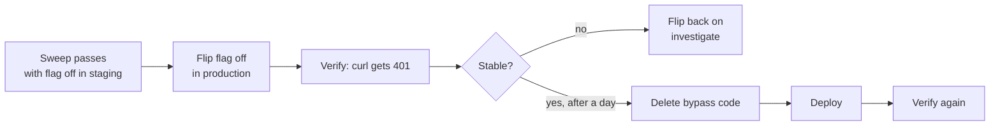

# Design: Cutover & Hardening

## Overview

Small in code, consequential in effect. The bypass that has been carrying the deployed
frontend through eleven tickets is switched off and then deleted.

The sequencing matters: **flip the flag first, delete the code second.** Flipping is reversible
in seconds by changing an environment variable; deleting is a deploy. Running with the flag off
for a day before removing the code means the rollback lever still exists while the change is
newest and most likely to need it.

---

## Cutover sequence



Step A is not optional. Turning the flag off in production without having run the sweep against
it first means discovering a missed `X-Shop-Id` header at the counter.

---

## What gets deleted

### `middleware/auth.js`

`requireAuth` and `requireRealAuth` collapse into one function. They differ only by the bypass
block, so once that is gone they are identical, and having two names for one behaviour is how a
future route ends up on the wrong guard.

```js
// after
export const requireAuth = (req, res, next) => {
  const header = req.header("authorization");
  const token = header?.startsWith("Bearer ") ? header.slice(7) : null;
  const payload = token && verifyAccessToken(token);
  if (!payload) return res.status(401).json({ message: "Sign in to continue" });
  req.user = { id: payload.sub, username: payload.username, role: payload.role, shops: payload.shops ?? [] };
  next();
};
```

Every `requireRealAuth` import — the auth router, the admin router — becomes `requireAuth`.

### `middleware/shopScope.js`

The legacy fallback block goes; the rest is unchanged.

### `config/env.js`

`legacyUnauth` and `legacyShopId` are removed, along with the startup warning in `server.js`.

### Tests

Delete the tests asserting bypass behaviour: "missing token yields the legacy actor with the
flag on", and `requireRealAuth`'s distinct behaviour.

**Keep** the test asserting that a present-but-invalid token is rejected. That was property P6
in ticket 03 — written to guard against the bypass being triggered by a malformed token — and
although the bypass is gone, the assertion it makes is the correct behaviour in its own right.
Rewrite it to drop the flag, not to drop the case.

---

## CORS review

`backend/middleware/index.js` currently reads:

```js
origin: [
  "http://localhost:5173",                 // local dev
  "https://pos-spincredible.vercel.app",   // replace with your frontend
],
```

The trailing comment is stale — that *is* the frontend. Resolve it, and confirm the list names
only origins actually in use. Add any Vercel preview origin the team relies on, or accept that
previews cannot reach the production API.

Worth being clear about what this does and does not do: CORS constrains browsers, not clients.
It was never a security control here, and with authentication in place it is even less of one.
The reason to tidy it is that a misleading comment costs someone an afternoon later.

---

## Data Models

No changes.

---

## Error Handling

| Condition | Before cutover | After cutover |
|---|---|---|
| No token, any scoped endpoint | Treated as manager on Shop 1 | 401 |
| No token, `/api/health` | 200 | 200 |
| Invalid token | 401 | 401 (unchanged) |
| Valid token, no `X-Shop-Id` | Shop 1 for a legacy actor; 400 otherwise | 400 |
| Old frontend bundle in a stale browser tab | Works | Fails with 401s until reloaded |

The last row is the one to communicate to the shop before flipping. A terminal left open on the
old bundle keeps working right up to the cutover and then stops; the fix is a reload, but
nobody will guess that unless told.

---

## Correctness Properties

### SP1 — No trace of the bypass

```powershell
rg -n "LEGACY_UNAUTH|legacyUnauth|legacyShopId|requireRealAuth" .
```
returns nothing outside `docs/`.

*Validates: 2.1, 2.2, 2.3, 2.4, 2.6*

### SP2 — Nothing is open

For every route registered in `server.js` other than `/api/health`, a request with no
`Authorization` header receives 401. Assert this by enumerating the router stack rather than by
listing paths by hand, so a route added later is covered automatically.

*Validates: 1.2, 1.3*

SP2 is worth writing as a real test rather than a manual check. It is the single assertion that
summarises the entire program, and it should fail loudly the day someone mounts a new router
without a guard.

---

## Testing Strategy

### The sweep

Two shops, three users. Shop A is the original with its real history; Shop B is created through
the console.

**Shop 1 integrity** — check first, since a problem here is the only unrecoverable one:

| Check | Expected |
|---|---|
| Row counts for all five scoped tables | Match the pre-program baselines from ticket 02 |
| Oldest and newest closed sale | Unchanged dates, totals and invoice numbers |
| Invoice series | Continues from where it was; no restart, no gap |
| A month's report from before the upgrade | Identical figures to before |
| Inventory stock levels | Unchanged |

**Permission matrix** — walk every capability row in
[the overview](../00-overview.md) as each of the three roles, confirming both that permitted
actions succeed and that forbidden ones return 403.

**Isolation:**

| Check | Expected |
|---|---|
| Shop A's catalog from Shop B | Not visible |
| Sell a shared item name at B | A's stock unchanged |
| A's sale id passed to a B-scoped request | 404 |
| Both shops' invoice series | Independent |
| Payment method deactivated at A | Still usable at B |

**Closed to anonymous:**

```powershell
# every one of these must be 401
curl -i https://<api>/api/inventory
curl -i https://<api>/api/open-sales
curl -i https://<api>/api/closed-sales
curl -i https://<api>/api/services
curl -i https://<api>/api/payment-methods
curl -i https://<api>/api/shop-profile
curl -i https://<api>/api/admin/audit
# and this one must be 200
curl -i https://<api>/api/health
```

**Per-shop behaviour:** receipts carry the right header; reports scope correctly; the offline
queue is separate per shop and syncs to the right one; the audit log shows each shop's events
and filters by shop.

### Regression suites

`npm test` in `backend/` and in `webapp/tuldokbenta_web/`, plus `npm run build` and
`npm run lint` on the frontend.

---

## The accepted-gaps record

`docs/specs/multipos/ACCEPTED-GAPS.md`, written as part of this ticket. Four entries at minimum,
each with what it is, why it was accepted, and what closing it would take:

1. **Reporting is not enforced server-side.** There is no reporting endpoint — the page derives
   everything in the browser from closed and open sales, both of which workers may read by
   decision. Hiding the nav link is a convenience. Closing it means either restricting workers'
   closed-sales access or building a manager-only aggregate endpoint.
2. **Deactivation is not immediate.** `requireAuth` performs no database read, so a deactivated
   user's access token stays valid until it expires — up to an hour. This is what keeps the hot
   path at one query. `token_version` plus a refusal at refresh is the immediate lever for the
   urgent case.
3. **Sale lines reference inventory by name string.** There is no foreign key from a sale's
   JSONB items to `inventory.item_name`, so renaming an item orphans historical lines. This
   predates the program and was deliberately left alone; normalising it is a data migration of
   its own.
4. **The receipt logo is hotlinked.** Receipts depend on an external image host being reachable
   at print time. Ticket 09 made the URL configurable, which is the precondition for storing a
   data URI instead, but did not change the default.

The point of the file is that a future maintainer finding any of these does not spend a day
deciding whether it was a mistake.
